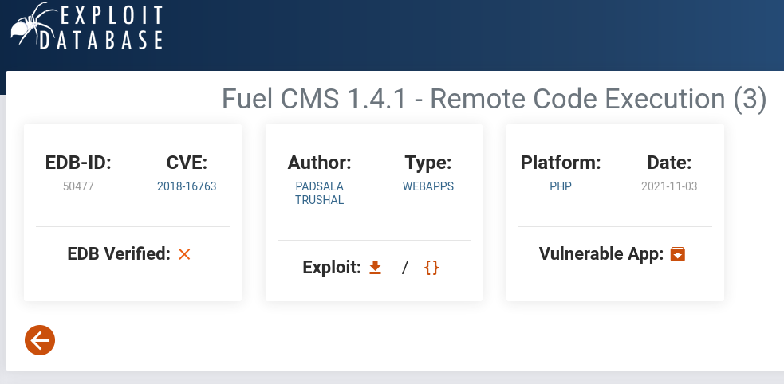
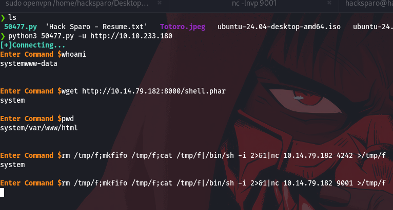
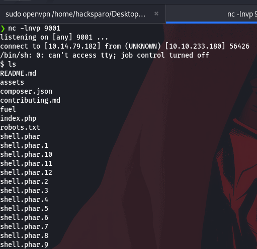
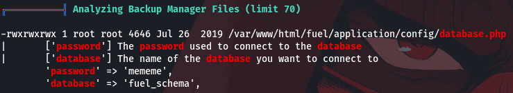
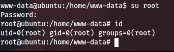

### nmap scan

```
PORT   STATE SERVICE VERSION
80/tcp open  http    Apache httpd 2.4.18 ((Ubuntu))
| http-robots.txt: 1 disallowed entry 
|_/fuel/
| http-methods: 
|_  Supported Methods: GET HEAD POST OPTIONS
|_http-title: Welcome to FUEL CMS
|_http-server-header: Apache/2.4.18 (Ubuntu)

```

### directory enumaration
i use Gobuster to find all the web page directory
```
/.html                (Status: 403) [Size: 293]
/.php                 (Status: 403) [Size: 292]
/index.php            (Status: 200) [Size: 16597]
/index                (Status: 200) [Size: 16597]
/home                 (Status: 200) [Size: 16597]
/0                    (Status: 200) [Size: 16597]
/assets               (Status: 301) [Size: 315] [--> http://10.10.233.180/assets/]
/robots.txt           (Status: 200) [Size: 30]
/'.html               (Status: 400) [Size: 1134]
/'.txt                (Status: 400) [Size: 1134]
/'                    (Status: 400) [Size: 1134]
/'.js                 (Status: 400) [Size: 1134]

```

after visiting the web page i found the CMS, and its version and the version is vulnerable to remote code execution this is the CVE associated to the 



after i downloaded the script and run it i was able to execute commands on the target system and this is how it looks like 

 
and here is the shell i got after executing that command 


now time to escalate our privilege to the root user first I uploaded and launch linpeas
and i found the database credentials


i connected to mysql using the user root and the password the we found which is "mememe" and nothing interesting in the database so what comes in my mind is to try to switch to the user root using the same password
and guest what 


#                                               Ignite is down 
